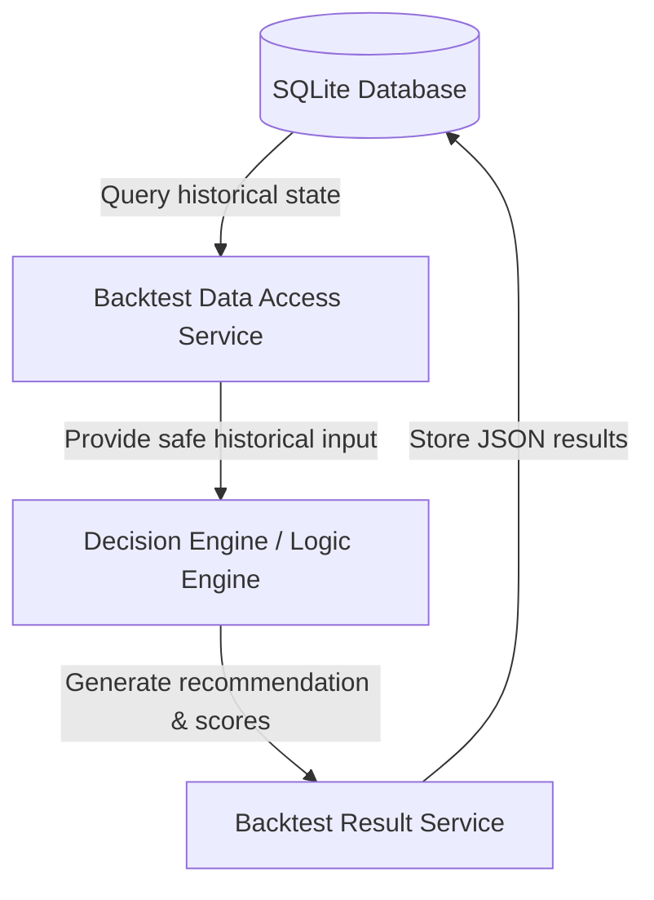

# Week 14 — End-to-End Backtest Integration

## System Architecture



## Integration Verification
The end-to-end integration is verified via the test module:
* File: [`backend/data_pipeline/test_week14_integration.py`](file:///c:/Users/vigne/OneDrive/Desktop/projects/SWING%20TOOL/swing-trading-tool1/backend/data_pipeline/test_week14_integration.py)

The integration test performs the following steps:
1. Loops over multiple representative stock tickers: `INFY`, `TCS`, `RELIANCE`.
2. Loops across a multi-date range of evaluation dates.
3. Retrieves safe, point-in-time inputs from `Backtest Data Access Service` for each evaluation date.
4. Feeds the values to the Logic Engine's `calculate_opportunity_score` API.
5. Receives the composite scores and recommendations.
6. Packages and stores the run results using `store_backtest_results` in `Backtest Result Service`.
7. Retrieves the stored results from the SQLite database and verifies that:
   * 54 records are written successfully.
   * No duplicates are created.
   * Row structures are fully validated.
   * Retrieval filters by `run_id`, `symbol`, and `date_range` return correct results.

## Automated Verification Command
To run all tests (including data access, storage, and integration):
```bash
python -m unittest discover -s backend\data_pipeline -p "test_*.py" -v
```
All 97 test cases ran and passed successfully.
